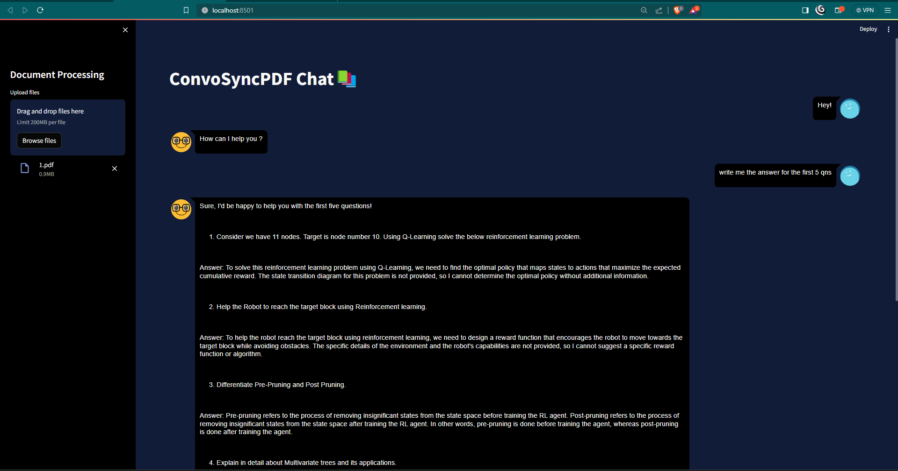

# ConvoSyncPDF Chat

ConvoSyncPDF Chat is a Python application that leverages the power of **Llama 2** for data-driven extraction and **LangChain** for response generation through chat. It enables a conversational interface for interacting with documents, such as PDFs, using natural language queries.

## Features

- Seamless integration with **Llama 2** for data-driven extraction.
- Utilizes **LangChain** to generate responses based on user queries.
- Supports various document formats, including PDFs, with automatic text extraction.
- Conversational interface for a user-friendly experience.
- Easy setup and configuration.

## Prerequisites

Before running ConvoSyncPDF Chat, make sure you have the following installed:

- Python 3.x
- Required Python libraries (specified in `requirements.txt`)
  


## Setup

1. Clone the repository:

    ```bash
    git clone https://github.com/kasiviswanathanR/ConvoSyncPDF-Chat.git
    ```

2. Navigate to the project directory:

    ```bash
    cd ConvoSyncPDF-Chat
    ```

3. Install the required dependencies:

    ```bash
    pip install -r requirements.txt
    ```

4. Set up your environment variables. Create a `.env` file with the following:

    ```env
    # .env file
    API_KEY=your_api_key
    ```

    Replace `your_api_key` with the API key obtained from Llama 2.

## Usage

1. Run the ConvoSyncPDF Chat application:

    ```bash
    streamlit run app.py
    ```

2. Access the application through your web browser at `http://localhost:8501`.

3. Upload your documents (PDFs, DOCX, TXT) to initiate the chat.

## Configuration

- You can customize the chat interface and behavior in `app.py`.
- Modify the Llama 2 API key in the `.env` file for secure communication.

## Contributing

If you find any issues or have suggestions for improvements, feel free to open an issue or submit a pull request.

## License

This project is licensed under the [MIT License](LICENSE).

---

Happy chatting with ConvoSyncPDF! 📚🗣️
